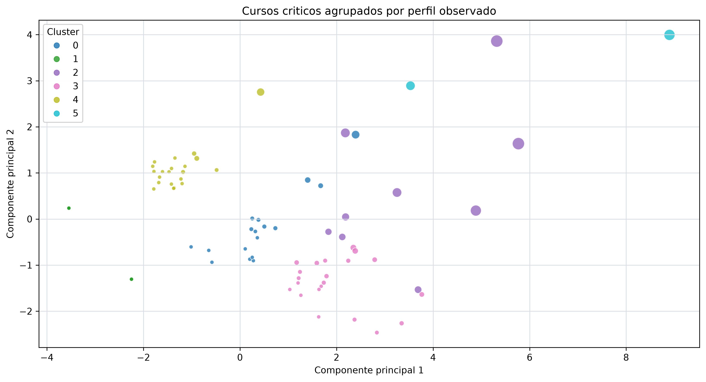
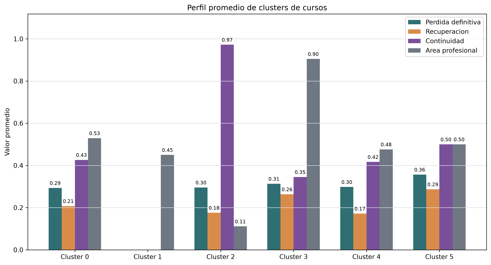

# Clustering de cursos criticos

## Objetivo

Agrupar cursos segun indicadores agregados de perdida definitiva, recuperacion,
continuidad de oferta, bloqueo curricular y volumen academico observado en
2024.

El clustering es descriptivo. Los clusters no son categorias naturales ni
prueban causalidad; sirven para resumir perfiles de cursos que pueden requerir
lectura academica conjunta.

## Tablas generadas

| tabla | ruta |
| --- | --- |
| 08_metricas_clustering | outputs/tables/clusters/08_metricas_clustering.csv |
| 08_cursos_clusterizados | outputs/tables/clusters/08_cursos_clusterizados.csv |
| 08_perfil_clusters | outputs/tables/clusters/08_perfil_clusters.csv |
| 08_catalogo_figuras_clustering | outputs/tables/clusters/08_catalogo_figuras_clustering.csv |

## Seleccion de K

| k | inercia | silhouette | davies_bouldin | calinski_harabasz | k_seleccionado |
| --- | --- | --- | --- | --- | --- |
| 2 | 673.132 | 0.356 | 1.151 | 53.191 | False |
| 3 | 531.753 | 0.356 | 1.208 | 44.849 | False |
| 4 | 405.151 | 0.385 | 1.099 | 47.749 | False |
| 5 | 335.453 | 0.408 | 1.073 | 47.165 | False |
| 6 | 268.835 | 0.423 | 0.993 | 50.691 | True |

Se selecciona `k=6` porque obtuvo el mayor silhouette entre
las opciones evaluadas de 2 a 6 clusters, cuando el
tamano del dataset lo permite.

## Perfil de clusters

| cluster | etiqueta_descriptiva | cursos | tasa_perdida_definitiva_2024_media | tasa_recuperacion_2024_media | indice_continuidad_oferta_media | proporcion_area_profesional | estudiantes_en_riesgo_retraso_curricular_2024 |
| --- | --- | --- | --- | --- | --- | --- | --- |
| 0 | Criticidad baja o intermedia | 17 | 29.3% | 20.8% | 42.6% | 52.9% | 107.0 |
| 1 | Sin actividad evaluada observable | 20 | 0.0% | 0.0% | 0.0% | 45.0% | 0.0 |
| 2 | Criticidad baja o intermedia | 9 | 29.6% | 17.6% | 97.2% | 11.1% | 58.0 |
| 3 | Alta perdida y baja continuidad profesional | 21 | 31.3% | 26.3% | 34.5% | 90.5% | 154.0 |
| 4 | Criticidad baja o intermedia | 21 | 29.8% | 17.2% | 41.7% | 47.6% | 0.0 |
| 5 | Perdida relativa alta | 2 | 35.7% | 28.7% | 50.0% | 50.0% | 92.0 |

## Figuras generadas e interpretacion

### 08_clusters_cursos.png

- Pregunta analitica: Que perfiles de cursos criticos emergen al combinar perdida, continuidad y bloqueo curricular?
- Descripcion: Dispersion de cursos sobre dos componentes principales, coloreada por cluster asignado.
- Interpretacion: El cluster con mayor cantidad de cursos es el 4, con 21 cursos.
- Conclusion: La agrupacion permite priorizar perfiles de cursos, no categorias naturales definitivas.
- Ruta: `outputs/figures/clusters/08_clusters_cursos.png`
### 08_perfil_clusters.png

- Pregunta analitica: Como difieren los clusters en perdida, recuperacion, continuidad y area profesional?
- Descripcion: Barras comparativas de indicadores promedio por cluster.
- Interpretacion: El cluster 5 presenta la mayor tasa media de perdida definitiva observada: 35.7%.
- Conclusion: El perfil promedio ayuda a explicar por que ciertos cursos deben revisarse junto con continuidad de oferta.
- Ruta: `outputs/figures/clusters/08_perfil_clusters.png`

## Limitaciones

- El resultado depende de las variables agregadas disponibles para 2024.
- Las variables fueron escaladas para que los conteos y tasas puedan compararse
  dentro del algoritmo.
- Los clusters deben interpretarse como perfiles descriptivos y no como
  diagnosticos individuales de cursos.
- No se utilizan docentes ni identificadores individuales.

## Conclusion

La agrupacion de cursos criticos sintetiza patrones de perdida, recuperacion,
continuidad y bloqueo curricular en perfiles comparables. Estos perfiles ayudan
a complementar los rankings de Fase 5 y la inferencia de Fase 6, manteniendo
una lectura exploratoria y sin afirmar causalidad.
