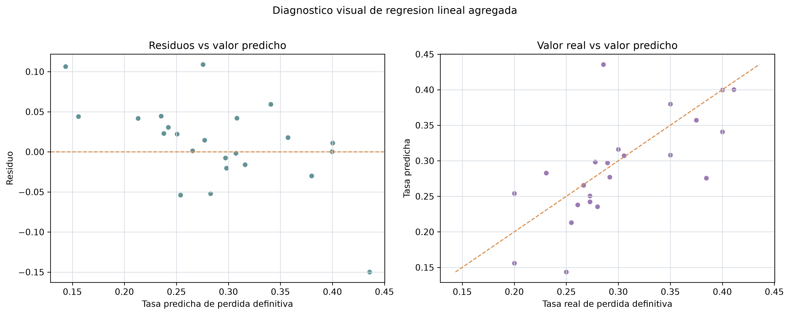

# Regresion lineal agregada

## Objetivo

Estimar de forma exploratoria la asociacion entre caracteristicas agregadas de
oferta, volumen, continuidad y estructura curricular con la tasa de perdida
definitiva a nivel curso-periodo.

El modelo es descriptivo y no causal. No debe usarse para diagnosticar
estudiantes ni para atribuir responsabilidades individuales.

## Controles metodologicos

- Unidad de analisis: curso-periodo.
- Target: `tasa_perdida_definitiva`.
- Se filtran filas con menos de 10 registros ordinarios para
  evitar tasas inestables.
- Se excluyen variables derivadas directamente de resultados academicos finales
  para reducir fuga de informacion.
- No se usa `docente` ni identificadores individuales.

## Tablas generadas

| tabla | ruta |
| --- | --- |
| 08_metricas_regresion | outputs/tables/regression/08_metricas_regresion.csv |
| 08_coeficientes_regresion | outputs/tables/regression/08_coeficientes_regresion.csv |
| 08_predicciones_regresion | outputs/tables/regression/08_predicciones_regresion.csv |
| 08_catalogo_figuras_regresion | outputs/tables/regression/08_catalogo_figuras_regresion.csv |

## Metricas

| modelo_nombre | n_total | n_train | n_test | r2 | mae | rmse |
| --- | --- | --- | --- | --- | --- | --- |
| Regresion lineal agregada | 89 | 66 | 23 | 0.216 | 0.039 | 0.054 |

## Coeficientes destacados

| variable | variable_transformada | coeficiente |
| --- | --- | --- |
| patron_oferta | cat__patron_oferta_oferta_unica | -0.229 |
| patron_oferta | cat__patron_oferta_oferta_semestral | -0.176 |
| patron_oferta | cat__patron_oferta_oferta_mixta | -0.112 |
| indice_continuidad_oferta_anual | num__indice_continuidad_oferta_anual | -0.106 |
| cupo_total_ofertado | num__cupo_total_ofertado | 0.098 |
| periodo_academico | cat__periodo_academico_V1 | 0.097 |
| area_academica | cat__area_academica_Desarrollo de Software | 0.067 |
| periodo_academico | cat__periodo_academico_S2 | -0.065 |
| area_academica | cat__area_academica_Metodologia de Sistemas | -0.065 |
| requiere_laboratorio | cat__requiere_laboratorio_Si | 0.052 |
| secciones_abiertas | num__secciones_abiertas | -0.051 |
| estudiantes_asignados | num__estudiantes_asignados | -0.050 |
| curso_obligatorio | cat__curso_obligatorio_Si | 0.047 |
| area_academica | cat__area_academica_EPS | 0.044 |
| tipo_curso_configurado | cat__tipo_curso_configurado_practico | -0.041 |

Los coeficientes se reportan como lectura exploratoria. Su signo y magnitud
dependen del conjunto de variables, escalamiento y codificacion de categorias.

## Variables excluidas por cercania al resultado

| variable_excluida |
| --- |
| aprobados_ordinario |
| reprobados_ordinario |
| estudiantes_recuperacion |
| aprobados_recuperacion |
| perdida_definitiva |
| nsp_total |
| equivalencias_total |
| tasa_aprobacion_ordinaria |
| tasa_perdida_ordinaria |
| tasa_recuperacion |
| tasa_aprobacion_recuperacion |
| indice_dependencia_recuperacion |
| promedio_zona_ordinaria |
| promedio_examen_ordinario |
| promedio_nota_total_ordinario |
| estudiantes_sin_oportunidad_inmediata |
| estudiantes_en_riesgo_retraso_curricular |

## Figuras generadas e interpretacion

### 08_regresion_residuos.png

- Pregunta analitica: Que tan alineadas estan las tasas reales y predichas de perdida definitiva?
- Descripcion: Dispersion de residuos contra valores predichos y comparacion entre valor real y predicho.
- Interpretacion: El residuo absoluto promedio observado en prueba es 0.039 puntos de tasa.
- Conclusion: La grafica permite revisar errores agregados y detectar dispersion, sin afirmar causalidad.
- Ruta: `outputs/figures/models/08_regresion_residuos.png`

## Limitaciones

- La regresion usa observaciones de 2024 y no reconstruye trayectorias
  academicas completas.
- Las variables categoricas se expanden mediante one-hot encoding, por lo que
  los coeficientes deben interpretarse respecto a categorias de referencia
  implicitas.
- Algunas relaciones pueden ser no lineales; este modelo resume solo una
  aproximacion lineal agregada.
- La tasa de perdida definitiva puede verse afectada por tamanos de muestra y
  heterogeneidad entre cursos.

## Conclusion

La regresion lineal agregada aporta una lectura complementaria sobre como se
asocian continuidad, volumen, periodo, area y estructura curricular con la tasa
de perdida definitiva observada. Sus resultados deben usarse para orientar
preguntas y priorizar cursos, no para afirmar causalidad.
