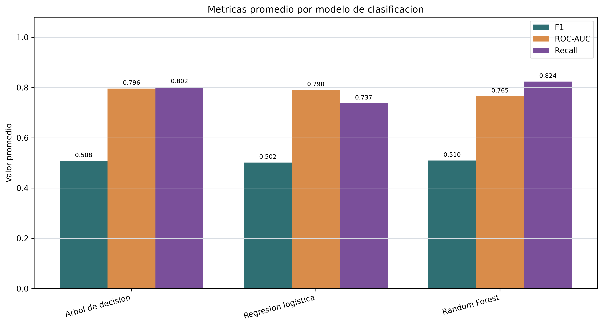
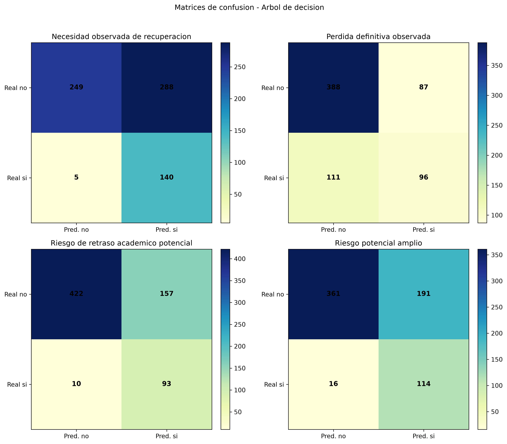
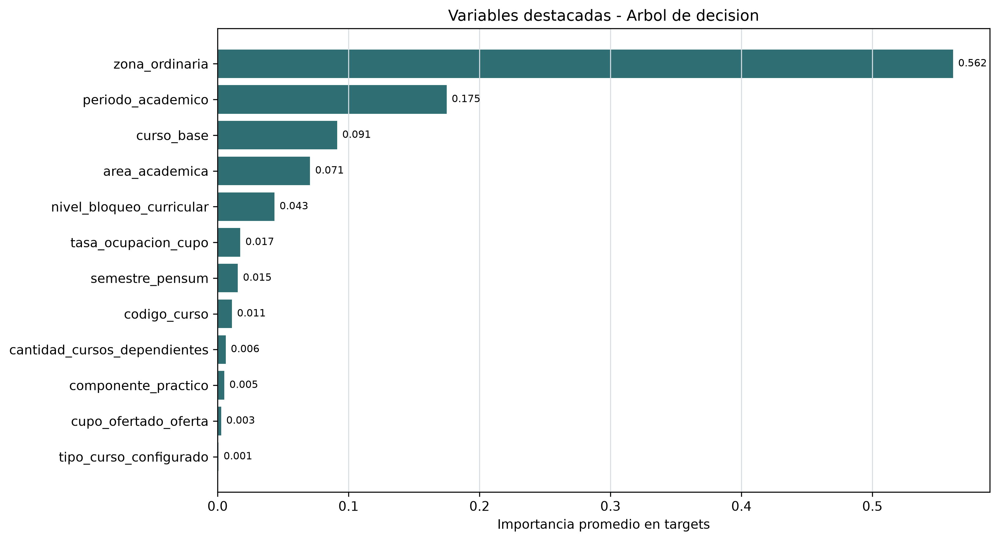
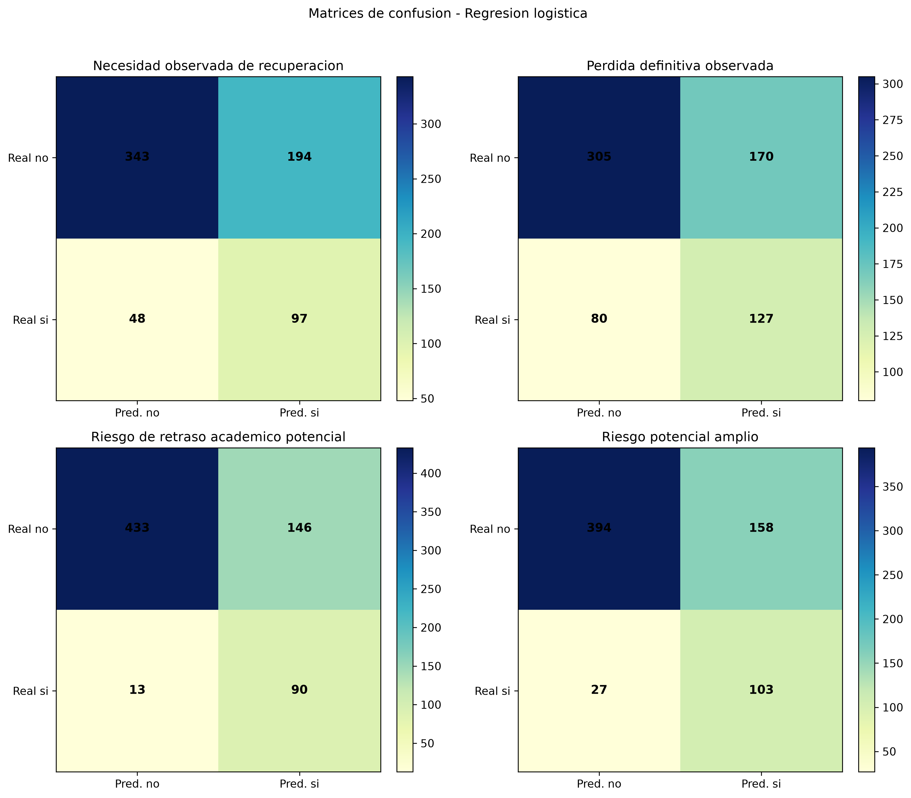
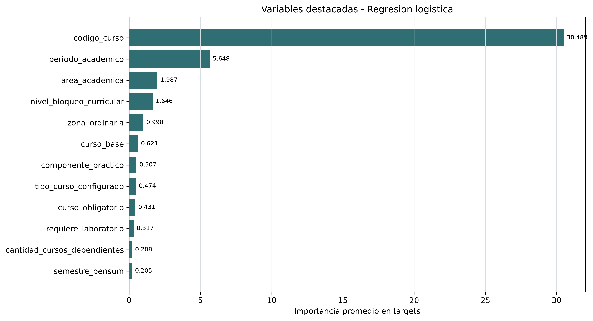
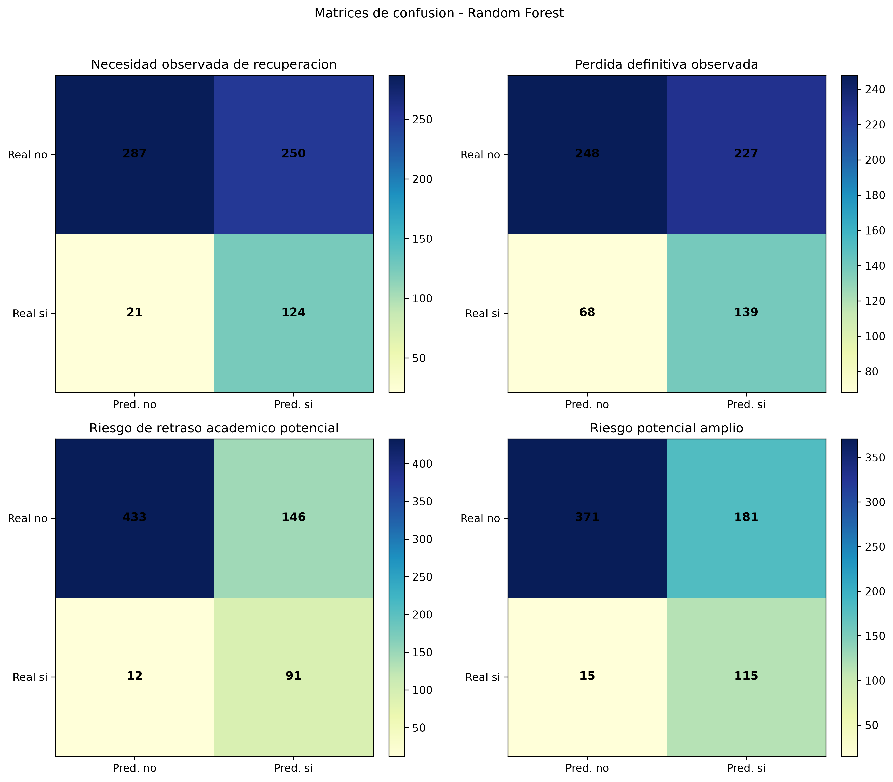
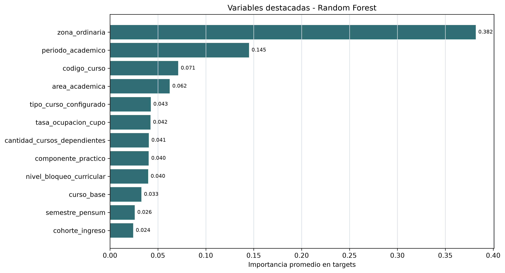

# Resultados de modelos de clasificacion

## Objetivo

Entrenar modelos exploratorios de clasificacion para describir patrones predictivos asociados a recuperacion, perdida definitiva y riesgo de retraso academico potencial en los registros modelables de 2024.

La lectura de esta fase es explicativa y comparativa. Los modelos no demuestran causalidad y no deben interpretarse como diagnosticos individuales.

## Controles metodologicos

- Se utiliza `data/processed/ds_modelo_clasificacion.csv`, que excluye desasignados y variables con fuga de informacion.
- No se utiliza `docente`, identificadores individuales ni notas finales como predictores.
- Las columnas de oferta posterior se excluyen como predictores para evitar que el modelo use componentes cercanos a los targets de riesgo.
- Las particiones de entrenamiento y prueba usan estratificacion cuando el target tiene ambas clases con frecuencia suficiente.
- Se usa `random_state=2024` y `test_size=0.25` para reproducibilidad.
- Las metricas se interpretan junto con la prevalencia del target; no se usa accuracy como unica referencia.

## Tablas generadas

| tabla | ruta |
| --- | --- |
| 07_metricas_modelos | outputs/tables/models/07_metricas_modelos.csv |
| 07_importancias_variables | outputs/tables/models/07_importancias_variables.csv |
| 07_matrices_confusion | outputs/tables/models/07_matrices_confusion.csv |
| 07_catalogo_figuras_modelos | outputs/tables/models/07_catalogo_figuras_modelos.csv |
| 07_validacion_targets_modelos | outputs/tables/models/07_validacion_targets_modelos.csv |

## Metricas por modelo y target

| modelo | target | prevalencia_test | accuracy | precision | recall | f1 | roc_auc | precision_promedio |
| --- | --- | --- | --- | --- | --- | --- | --- | --- |
| Regresion logistica | Necesidad observada de recuperacion | 0.213 | 0.645 | 0.333 | 0.669 | 0.445 | 0.743 | 0.406 |
| Regresion logistica | Perdida definitiva observada | 0.304 | 0.633 | 0.428 | 0.614 | 0.504 | 0.701 | 0.497 |
| Regresion logistica | Riesgo de retraso academico potencial | 0.151 | 0.767 | 0.381 | 0.874 | 0.531 | 0.881 | 0.516 |
| Regresion logistica | Riesgo potencial amplio | 0.191 | 0.729 | 0.395 | 0.792 | 0.527 | 0.837 | 0.469 |
| Arbol de decision | Necesidad observada de recuperacion | 0.213 | 0.570 | 0.327 | 0.966 | 0.489 | 0.739 | 0.351 |
| Arbol de decision | Perdida definitiva observada | 0.304 | 0.710 | 0.525 | 0.464 | 0.492 | 0.737 | 0.519 |
| Arbol de decision | Riesgo de retraso academico potencial | 0.151 | 0.755 | 0.372 | 0.903 | 0.527 | 0.883 | 0.517 |
| Arbol de decision | Riesgo potencial amplio | 0.191 | 0.696 | 0.374 | 0.877 | 0.524 | 0.825 | 0.471 |
| Random Forest | Necesidad observada de recuperacion | 0.213 | 0.603 | 0.332 | 0.855 | 0.478 | 0.705 | 0.325 |
| Random Forest | Perdida definitiva observada | 0.304 | 0.567 | 0.380 | 0.671 | 0.485 | 0.686 | 0.460 |
| Random Forest | Riesgo de retraso academico potencial | 0.151 | 0.768 | 0.384 | 0.883 | 0.535 | 0.863 | 0.485 |
| Random Forest | Riesgo potencial amplio | 0.191 | 0.713 | 0.389 | 0.885 | 0.540 | 0.807 | 0.400 |

## Modelos destacados por target

| target | mejor_f1 | f1 | mejor_recall | recall | lectura |
| --- | --- | --- | --- | --- | --- |
| Necesidad observada de recuperacion | Arbol de decision | 0.489 | Arbol de decision | 0.966 | F1 balancea precision y recall; recall prioriza capturar casos positivos observados. |
| Perdida definitiva observada | Regresion logistica | 0.504 | Random Forest | 0.671 | F1 balancea precision y recall; recall prioriza capturar casos positivos observados. |
| Riesgo de retraso academico potencial | Random Forest | 0.535 | Arbol de decision | 0.903 | F1 balancea precision y recall; recall prioriza capturar casos positivos observados. |
| Riesgo potencial amplio | Random Forest | 0.540 | Random Forest | 0.885 | F1 balancea precision y recall; recall prioriza capturar casos positivos observados. |

## Variables con mayor peso exploratorio

| modelo | target | variables_destacadas |
| --- | --- | --- |
| Arbol de decision | Necesidad observada de recuperacion | zona_ordinaria, periodo_academico, tasa_ocupacion_cupo, componente_practico, tipo_curso_configurado |
| Arbol de decision | Perdida definitiva observada | zona_ordinaria, periodo_academico, tasa_ocupacion_cupo, area_academica, componente_practico |
| Arbol de decision | Riesgo de retraso academico potencial | zona_ordinaria, curso_base, nivel_bloqueo_curricular, area_academica, periodo_academico |
| Arbol de decision | Riesgo potencial amplio | zona_ordinaria, periodo_academico, curso_base, area_academica, tasa_ocupacion_cupo |
| Random Forest | Necesidad observada de recuperacion | zona_ordinaria, periodo_academico, tasa_ocupacion_cupo, codigo_curso, cupo_ofertado_oferta |
| Random Forest | Perdida definitiva observada | zona_ordinaria, codigo_curso, periodo_academico, tasa_ocupacion_cupo, area_academica |
| Random Forest | Riesgo de retraso academico potencial | zona_ordinaria, periodo_academico, nivel_bloqueo_curricular, area_academica, cantidad_cursos_dependientes |
| Random Forest | Riesgo potencial amplio | zona_ordinaria, periodo_academico, area_academica, codigo_curso, curso_base |
| Regresion logistica | Necesidad observada de recuperacion | codigo_curso, periodo_academico, zona_ordinaria, area_academica, curso_obligatorio |
| Regresion logistica | Perdida definitiva observada | codigo_curso, periodo_academico, zona_ordinaria, area_academica, curso_obligatorio |
| Regresion logistica | Riesgo de retraso academico potencial | codigo_curso, periodo_academico, nivel_bloqueo_curricular, area_academica, curso_base |
| Regresion logistica | Riesgo potencial amplio | codigo_curso, periodo_academico, area_academica, zona_ordinaria, curso_base |

Estas variables no deben interpretarse como causas. Indican que el modelo las uso para separar patrones observados en el conjunto de prueba, dentro de las variables disponibles y la ventana 2024.

## Figuras generadas e interpretacion

### 07_metricas_modelos.png

- Pregunta analitica: Que modelo presenta mejor equilibrio promedio entre metricas de clasificacion?
- Descripcion: Barras comparativas de F1, ROC-AUC y recall promedio por modelo.
- Interpretacion: El modelo con mayor F1 promedio observado es Random Forest con 0.510.
- Conclusion: La comparacion permite elegir modelos por equilibrio de metricas, no solo por exactitud global.
- Ruta: `outputs/figures/models/07_metricas_modelos.png`

### 07_matrices_confusion_decision_tree.png

- Pregunta analitica: Como se distribuyen aciertos y errores para Arbol de decision?
- Descripcion: Matrices de confusion por target para Arbol de decision.
- Interpretacion: Las celdas muestran verdaderos negativos, falsos positivos, falsos negativos y verdaderos positivos para cada target.
- Conclusion: La matriz de confusion ayuda a revisar si el modelo esta capturando casos positivos o concentrandose en la clase mayoritaria.
- Ruta: `outputs/figures/models/07_matrices_confusion_decision_tree.png`

### 07_importancias_decision_tree.png

- Pregunta analitica: Que variables pesan mas en Arbol de decision?
- Descripcion: Ranking agregado de variables con mayor importancia para Arbol de decision.
- Interpretacion: La variable agregada con mayor importancia promedio es zona_ordinaria.
- Conclusion: Las importancias orientan la lectura explicativa del modelo, sin implicar causalidad.
- Ruta: `outputs/figures/models/07_importancias_decision_tree.png`

### 07_matrices_confusion_logistic_regression.png

- Pregunta analitica: Como se distribuyen aciertos y errores para Regresion logistica?
- Descripcion: Matrices de confusion por target para Regresion logistica.
- Interpretacion: Las celdas muestran verdaderos negativos, falsos positivos, falsos negativos y verdaderos positivos para cada target.
- Conclusion: La matriz de confusion ayuda a revisar si el modelo esta capturando casos positivos o concentrandose en la clase mayoritaria.
- Ruta: `outputs/figures/models/07_matrices_confusion_logistic_regression.png`

### 07_importancias_logistic_regression.png

- Pregunta analitica: Que variables pesan mas en Regresion logistica?
- Descripcion: Ranking agregado de variables con mayor importancia para Regresion logistica.
- Interpretacion: La variable agregada con mayor importancia promedio es codigo_curso.
- Conclusion: Las importancias orientan la lectura explicativa del modelo, sin implicar causalidad.
- Ruta: `outputs/figures/models/07_importancias_logistic_regression.png`

### 07_matrices_confusion_random_forest.png

- Pregunta analitica: Como se distribuyen aciertos y errores para Random Forest?
- Descripcion: Matrices de confusion por target para Random Forest.
- Interpretacion: Las celdas muestran verdaderos negativos, falsos positivos, falsos negativos y verdaderos positivos para cada target.
- Conclusion: La matriz de confusion ayuda a revisar si el modelo esta capturando casos positivos o concentrandose en la clase mayoritaria.
- Ruta: `outputs/figures/models/07_matrices_confusion_random_forest.png`

### 07_importancias_random_forest.png

- Pregunta analitica: Que variables pesan mas en Random Forest?
- Descripcion: Ranking agregado de variables con mayor importancia para Random Forest.
- Interpretacion: La variable agregada con mayor importancia promedio es zona_ordinaria.
- Conclusion: Las importancias orientan la lectura explicativa del modelo, sin implicar causalidad.
- Ruta: `outputs/figures/models/07_importancias_random_forest.png`

## Limitaciones

- Los modelos se entrenan con registros observados de 2024; no reconstruyen la trayectoria academica completa.
- `codigo_curso` puede capturar diferencias estructurales entre cursos; por eso sus importancias deben leerse junto con area, semestre, continuidad y variables curriculares.
- La zona ordinaria es una variable academica previa al cierre final del curso, pero su disponibilidad operativa puede depender del momento en que se quiera aplicar el modelo.
- Las clases positivas tienen prevalencias distintas; por eso precision, recall, F1, ROC-AUC y precision promedio deben revisarse en conjunto.
- No se utiliza informacion de docentes, presupuesto, contratacion, horas docentes ni identificadores individuales.

## Conclusion

La Fase 7 deja modelos de clasificacion reproducibles para comparar regresion logistica, arbol de decision y Random Forest sobre los cuatro targets academicos definidos. Los resultados sirven para priorizar variables y cursos en analisis posteriores, manteniendo una lectura exploratoria, agregada y sin afirmaciones causales.
