# Resumen de indicadores y EDA

## Objetivo

Describir la oferta academica observada, asignaciones, resultados registrados,
continuidad de oferta y riesgo de retraso academico potencial durante 2024.

El analisis es descriptivo. No afirma causalidad y no utiliza variables de
docencia, contratacion, presupuesto ni identificadores individuales en las
salidas publicas.

## Tablas generadas

| tabla | ruta |
| --- | --- |
| 05_catalogo_figuras_eda | outputs/tables/indicators/05_catalogo_figuras_eda.csv |
| 05_continuidad_curso | outputs/tables/indicators/05_continuidad_curso.csv |
| 05_cursos_area_comun | outputs/tables/indicators/05_cursos_area_comun.csv |
| 05_cursos_bloqueantes_baja_continuidad | outputs/tables/indicators/05_cursos_bloqueantes_baja_continuidad.csv |
| 05_cursos_profesionales_perdida_relativa | outputs/tables/indicators/05_cursos_profesionales_perdida_relativa.csv |
| 05_cursos_profesionales_sin_oportunidad_posterior | outputs/tables/indicators/05_cursos_profesionales_sin_oportunidad_posterior.csv |
| 05_flujo_area_comun_posterior | outputs/tables/indicators/05_flujo_area_comun_posterior.csv |
| 05_flujo_profesional_posterior | outputs/tables/indicators/05_flujo_profesional_posterior.csv |
| 05_indicadores_area | outputs/tables/indicators/05_indicadores_area.csv |
| 05_indicadores_curso | outputs/tables/indicators/05_indicadores_curso.csv |
| 05_indicadores_periodo | outputs/tables/indicators/05_indicadores_periodo.csv |
| 05_oferta_por_grupo_area_periodo | outputs/tables/indicators/05_oferta_por_grupo_area_periodo.csv |
| 05_recursamiento_observable | outputs/tables/indicators/05_recursamiento_observable.csv |
| 05_recursamiento_por_area | outputs/tables/indicators/05_recursamiento_por_area.csv |
| 05_riesgo_por_area | outputs/tables/indicators/05_riesgo_por_area.csv |
| 05_riesgo_por_periodo | outputs/tables/indicators/05_riesgo_por_periodo.csv |
| 05_riesgo_por_semestre | outputs/tables/indicators/05_riesgo_por_semestre.csv |
| 05_top_necesidad_recuperacion | outputs/tables/indicators/05_top_necesidad_recuperacion.csv |
| 05_top_perdida_definitiva | outputs/tables/indicators/05_top_perdida_definitiva.csv |

## Indicadores por periodo

| periodo_academico | cursos_ofertados | cursos_no_ofertados | estudiantes_asignados | estudiantes_con_nota | tasa_aprobacion_ordinaria | tasa_recuperacion | tasa_perdida_definitiva | estudiantes_en_riesgo_retraso_curricular |
| --- | --- | --- | --- | --- | --- | --- | --- | --- |
| S1 | 51 | 39 | 1321 | 1244 | 60.0% | 25.0% | 28.7% | 195 |
| V1 | 17 | 73 | 259 | 249 | 61.8% | 0.0% | 38.2% | 0 |
| S2 | 48 | 42 | 1107 | 1047 | 59.2% | 25.8% | 29.2% | 147 |
| V2 | 16 | 74 | 192 | 186 | 60.8% | 0.0% | 39.2% | 69 |

Los cursos no ofertados por periodo se calculan contra el catalogo completo de
90 cursos. Por eso, cuando S1 muestra 51 cursos ofertados y 39 no ofertados,
los 39 corresponden a cursos del catalogo que no aparecen como oferta activa
en ese periodo, no a cursos cancelados ni necesariamente a cursos que debian
abrirse obligatoriamente.

## Separacion por area comun y area profesional

| grupo_area | area_academica | total_cursos_catalogo | cursos_con_oferta_2024 | cursos_sin_oferta_2024 | cursos_baja_continuidad | estudiantes_con_acta_ordinaria | perdida_definitiva | tasa_perdida_definitiva | indice_continuidad_promedio |
| --- | --- | --- | --- | --- | --- | --- | --- | --- | --- |
| Area comun | Ciencias Basicas y Complementarias | 41 | 30 | 11 | 27 | 1703 | 497 | 29.2% | 47.6% |
| Area profesional | Desarrollo de Software | 16 | 12 | 4 | 15 | 332 | 129 | 38.9% | 26.6% |
| Area profesional | Ciencias de la Computacion | 16 | 13 | 3 | 16 | 324 | 102 | 31.5% | 23.4% |
| Area profesional | Metodologia de Sistemas | 14 | 12 | 2 | 12 | 295 | 81 | 27.5% | 32.1% |
| Area profesional | EPS | 3 | 3 | 0 | 3 | 61 | 18 | 29.5% | 33.3% |

Para evitar que cursos masivos de area comun dominen toda la lectura, la Fase 5
separa `Area comun` de `Area profesional`. El conteo absoluto sigue siendo util
para medir volumen, pero los cursos profesionales se revisan tambien por tasa
de perdida e indice de continuidad de oferta.

## Cursos profesionales con mayor perdida relativa

| curso_etiqueta | estudiantes_con_acta_ordinaria | perdida_definitiva | tasa_perdida_definitiva | indice_continuidad_oferta | patron_oferta |
| --- | --- | --- | --- | --- | --- |
| 2796 - Introduccion a la Programacion y Computacion 1 | 144.0 | 62.0 | 43.1% | 50.0% | oferta_semestral |
| 2816 - Redes de Computadoras 1 | 36.0 | 15.0 | 41.7% | 50.0% | oferta_mixta |
| 2821 - Sistemas de Bases de Datos 2 | 10.0 | 4.0 | 40.0% | 25.0% | oferta_unica |
| 950 - Estadistica 2 | 10.0 | 4.0 | 40.0% | 50.0% | oferta_semestral |
| 2800 - Introduccion a la Programacion y Computacion 2 | 33.0 | 13.0 | 39.4% | 50.0% | oferta_semestral |
| 2817 - Sistemas de Bases de Datos 1 | 28.0 | 11.0 | 39.3% | 25.0% | oferta_unica |
| 2805 - Estructura de Datos | 18.0 | 7.0 | 38.9% | 25.0% | oferta_unica |
| 2814 - Sistemas Operativos 1 | 26.0 | 10.0 | 38.5% | 25.0% | oferta_unica |
| 2798 - Lenguajes Formales y de Programacion | 34.0 | 13.0 | 38.2% | 25.0% | oferta_unica |
| 2819 - Sistemas Operativos 2 | 24.0 | 9.0 | 37.5% | 25.0% | oferta_unica |

## Fase 5.1: Flujo posterior y recursamiento observable

| grupo_area | perdidas_definitivas | perdidas_con_oferta_posterior_2024 | perdidas_sin_oferta_posterior_2024 | recursamientos_observables | aprobaciones_posteriores | tasa_recursamiento_observable | tasa_aprobacion_al_recursar |
| --- | --- | --- | --- | --- | --- | --- | --- |
| Area comun | 435 | 343 | 92 | 333 | 203 | 76.6% | 61.0% |
| Area profesional | 319 | 88 | 231 | 85 | 39 | 26.6% | 45.9% |

Esta seccion usa identificadores ofuscados solo de forma interna para observar
si, despues de perder definitivamente un curso en S1, V1 o S2, el mismo
estudiante vuelve a aparecer en el mismo curso en un periodo posterior de 2024.
Las salidas son agregadas y no exponen registros individuales.

La ventana de observacion excluye perdidas en V2 porque no existe un periodo
posterior dentro de 2024 para medir recursamiento. Por eso, estos indicadores
deben leerse como flujo posterior observable en el anio, no como trayectoria
academica completa.

### Cursos profesionales con perdida y sin oferta posterior observable

| curso_etiqueta | perdidas_definitivas | perdidas_sin_oferta_posterior_2024 | tasa_perdidas_sin_oferta_posterior | recursamientos_observables | aprobaciones_posteriores |
| --- | --- | --- | --- | --- | --- |
| 2796 - Introduccion a la Programacion y Computacion 1 | 62 | 25 | 40.3% | 37 | 16 |
| 2798 - Lenguajes Formales y de Programacion | 13 | 13 | 100.0% | 0 | 0 |
| 2795 - Matematica de Computo 1 | 12 | 12 | 100.0% | 0 | 0 |
| 2797 - Logica de Sistemas | 12 | 12 | 100.0% | 0 | 0 |
| 2817 - Sistemas de Bases de Datos 1 | 11 | 11 | 100.0% | 0 | 0 |
| 2814 - Sistemas Operativos 1 | 10 | 10 | 100.0% | 0 | 0 |
| 2819 - Sistemas Operativos 2 | 9 | 9 | 100.0% | 0 | 0 |
| 2799 - Matematica de Computo 2 | 8 | 8 | 100.0% | 0 | 0 |
| 2818 - Practica Intemedia TI | 8 | 8 | 100.0% | 0 | 0 |
| 2811 - Arquitectura de Computadores y Ensambladores 1 | 7 | 7 | 100.0% | 0 | 0 |
| 2805 - Estructura de Datos | 7 | 7 | 100.0% | 0 | 0 |
| 2802 - Analisis Probabilistico | 7 | 7 | 100.0% | 0 | 0 |

Estos cursos ayudan a contrastar la hipotesis descriptiva del proyecto: una
mayor continuidad de oferta no garantiza aprobacion, pero puede ampliar la
ventana observable para recursar y cerrar cursos profesionales. La evidencia
tambien puede refutar parcialmente la hipotesis si existe oferta posterior y,
aun asi, se observa bajo recursamiento o baja aprobacion posterior.

## Hallazgos descriptivos principales

- El curso con mayor perdida definitiva observada es `169 - Matematica Basica 1` con 76 registros.
- El curso con mayor necesidad de recuperacion observada es `2796 - Introduccion a la Programacion y Computacion 1` con 46 registros.
- El curso profesional con mayor perdida relativa observada, usando al menos 10 registros evaluables, es `2796 - Introduccion a la Programacion y Computacion 1` con 43.1% e indice de continuidad 50.0%.
- El curso profesional con mayor perdida sin oferta posterior observable es `2796 - Introduccion a la Programacion y Computacion 1` con 25 registros dentro de la ventana S1-V1-S2.
- Se identifican 40 cursos bloqueantes o con dependencias directas con continuidad de oferta igual o menor a 50.0%.
- Los indicadores de riesgo se interpretan como riesgo academico potencial bajo la oferta observada y los resultados registrados; no prueban causalidad.

## Figuras generadas e interpretacion

### 05_cursos_ofertados_por_periodo.png

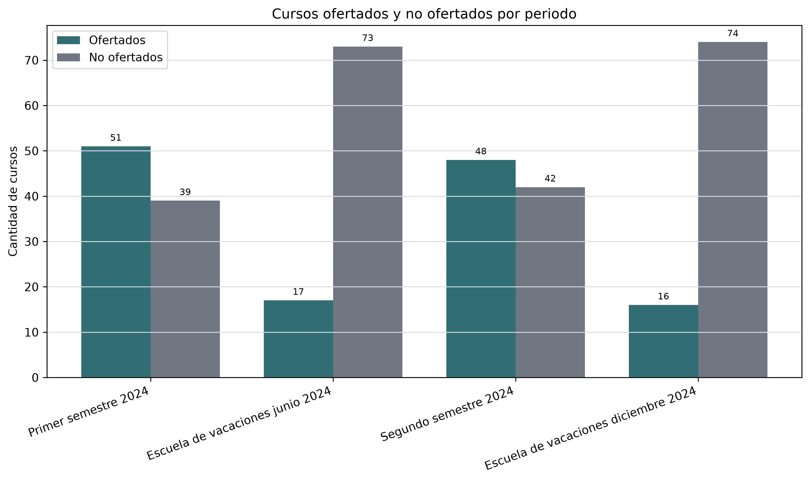

- Pregunta analitica: Cuantos cursos fueron ofertados y no ofertados por periodo academico?
- Descripcion: Barras comparativas de cursos ofertados y no ofertados en S1, V1, S2 y V2.
- Interpretacion: Primer semestre 2024 concentra la mayor cantidad de cursos ofertados, con 51 cursos.
- Conclusion: La oferta observada es mas amplia en periodos semestrales que en escuelas de vacaciones.
- Ruta: `outputs/figures/eda/05_cursos_ofertados_por_periodo.png`
### 05_asignaciones_por_periodo.png

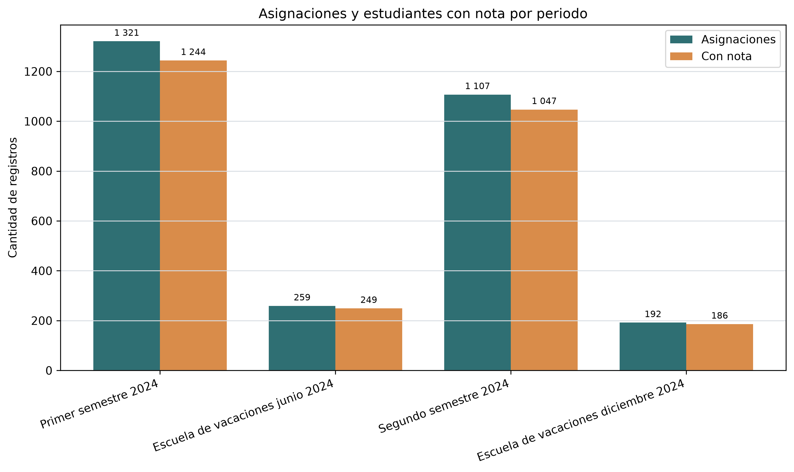

- Pregunta analitica: Como varia el volumen de asignaciones y estudiantes con nota por periodo?
- Descripcion: Barras comparativas de asignaciones registradas y estudiantes con nota por periodo.
- Interpretacion: Primer semestre 2024 registra el mayor volumen, con 1 321 asignaciones.
- Conclusion: El volumen de actividad academica evaluada se concentra principalmente en periodos semestrales.
- Ruta: `outputs/figures/eda/05_asignaciones_por_periodo.png`
### 05_top_perdida_definitiva.png

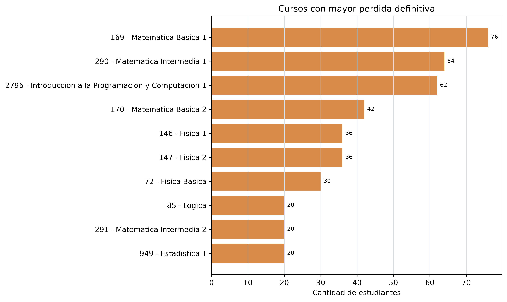

- Pregunta analitica: Que cursos concentran mayor perdida definitiva observada?
- Descripcion: Barras horizontales con los cursos de mayor perdida definitiva agregada en 2024.
- Interpretacion: El curso con mayor perdida definitiva observada es 169 - Matematica Basica 1, con 76 registros.
- Conclusion: El conteo absoluto identifica volumen de perdida, pero debe complementarse con tasa e indice de continuidad para comparar cursos masivos contra cursos de oferta menos frecuente.
- Ruta: `outputs/figures/eda/05_top_perdida_definitiva.png`
### 05_oferta_por_grupo_area_periodo.png

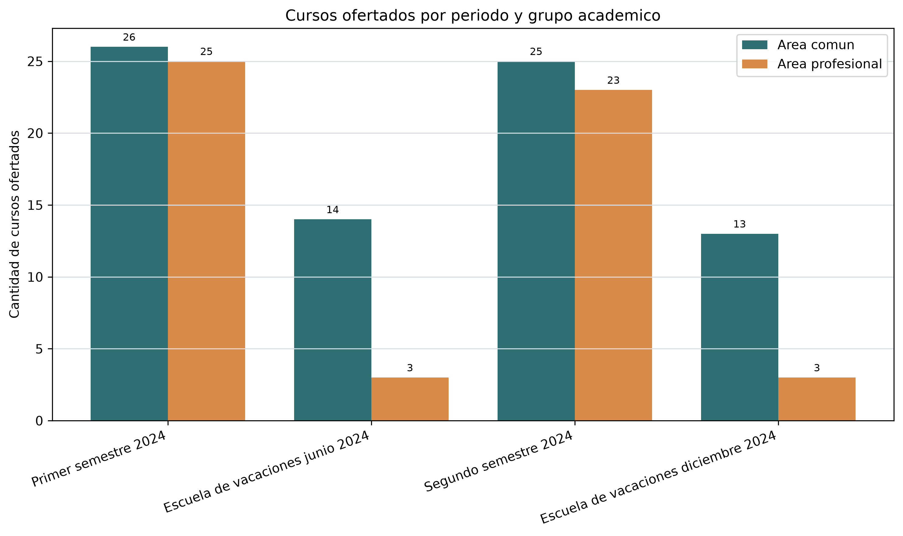

- Pregunta analitica: Como se distribuye la oferta entre area comun y area profesional por periodo?
- Descripcion: Barras comparativas de cursos ofertados por grupo academico en cada periodo.
- Interpretacion: En area profesional, Primer semestre 2024 presenta el mayor numero de cursos ofertados, con 25 cursos.
- Conclusion: La lectura por grupo academico evita interpretar los cursos no ofertados como una sola bolsa homogenea y permite separar area comun de cursos propios de la carrera.
- Ruta: `outputs/figures/eda/05_oferta_por_grupo_area_periodo.png`
### 05_cursos_profesionales_perdida_relativa.png

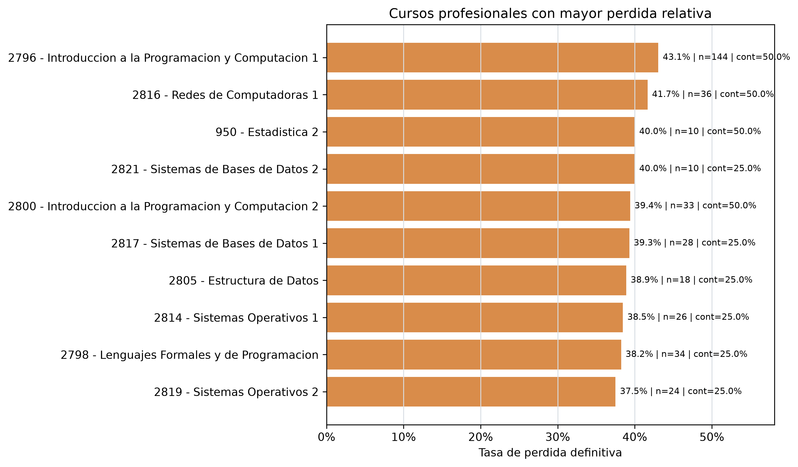

- Pregunta analitica: Que cursos profesionales combinan mayor perdida relativa y menor continuidad?
- Descripcion: Barras horizontales de tasa de perdida definitiva en cursos profesionales con volumen minimo de registros evaluables.
- Interpretacion: El curso profesional con mayor tasa observada es 2796 - Introduccion a la Programacion y Computacion 1, con 43.1%, n=144 e indice de continuidad 50.0%.
- Conclusion: Este ranking es mas adecuado para detectar vulnerabilidad academica en cursos profesionales que se ofertan pocas veces durante el anio.
- Ruta: `outputs/figures/eda/05_cursos_profesionales_perdida_relativa.png`
### 05_recursamiento_y_aprobacion_por_grupo.png

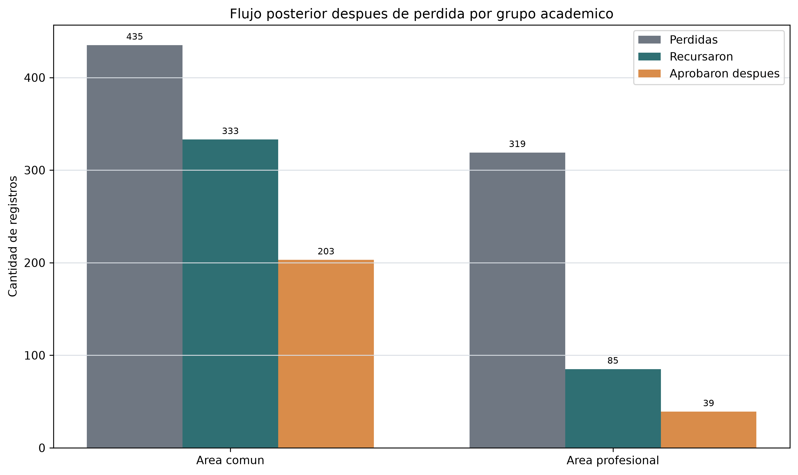

- Pregunta analitica: Que flujo posterior se observa despues de una perdida definitiva por grupo academico?
- Descripcion: Barras de perdidas definitivas, recursamientos observables y aprobaciones posteriores para area comun y area profesional.
- Interpretacion: Area comun concentra 333 recursamientos observables posteriores a una perdida definitiva dentro de 2024.
- Conclusion: El recursamiento observable permite medir flujo academico posterior sin asumir que la oferta por si sola asegura aprobacion.
- Ruta: `outputs/figures/eda/05_recursamiento_y_aprobacion_por_grupo.png`
### 05_profesional_perdida_sin_oferta_posterior.png

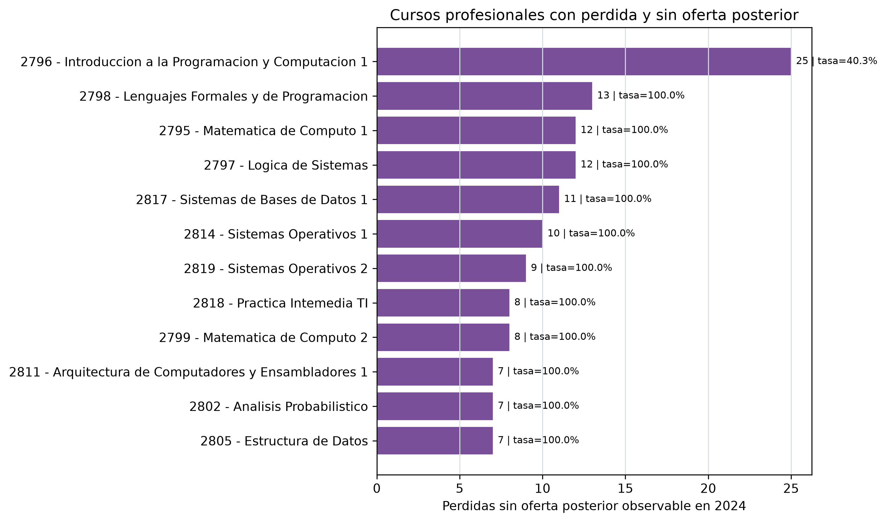

- Pregunta analitica: Que cursos profesionales acumulan perdidas sin oferta posterior observable?
- Descripcion: Barras de cursos profesionales con perdidas definitivas y sin oferta posterior durante 2024.
- Interpretacion: El curso profesional con mayor conteo es 2796 - Introduccion a la Programacion y Computacion 1, con 25 perdidas sin oferta posterior observable en 2024.
- Conclusion: Estos cursos representan candidatos prioritarios para revisar continuidad de oferta, porque la perdida coincide con menor ventana observable de recursamiento.
- Ruta: `outputs/figures/eda/05_profesional_perdida_sin_oferta_posterior.png`
### 05_heatmap_oferta_curso_periodo.png

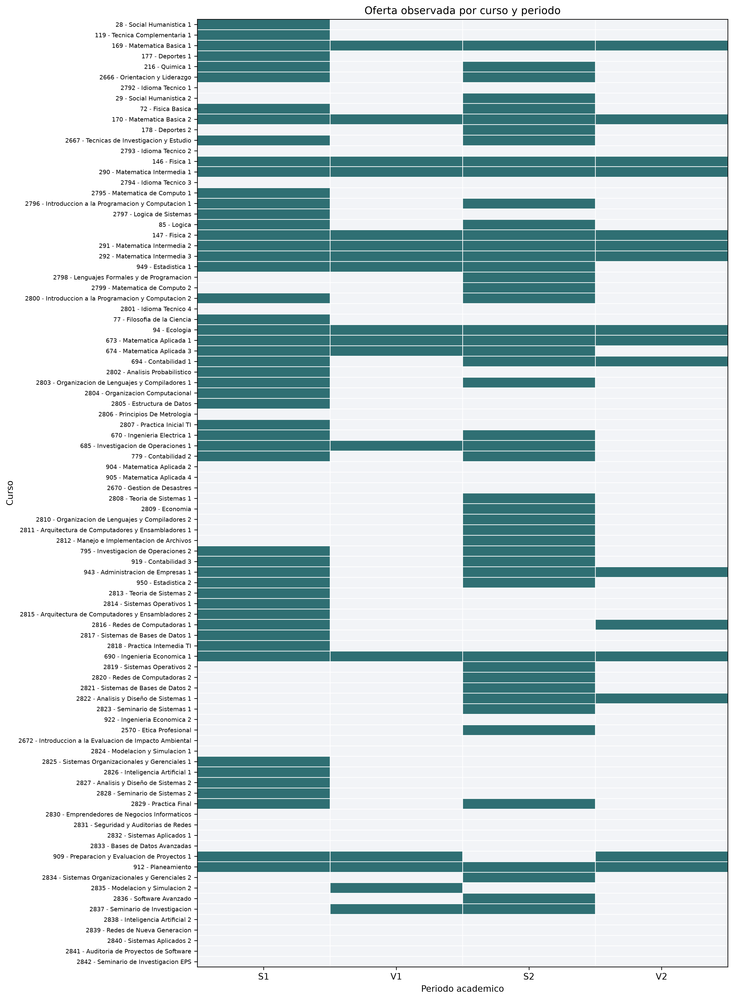

- Pregunta analitica: Que patron de continuidad de oferta muestra cada curso durante 2024?
- Descripcion: Matriz curso-periodo donde cada celda indica si el curso fue ofertado en el periodo observado.
- Interpretacion: El patron mas frecuente es `oferta_unica`. Se identifican 40 cursos bloqueantes o dependientes con continuidad baja.
- Conclusion: La continuidad de oferta es heterogenea y requiere analizar cursos con dependencia curricular.
- Ruta: `outputs/figures/eda/05_heatmap_oferta_curso_periodo.png`
### 05_distribucion_aprobacion_semestre.png

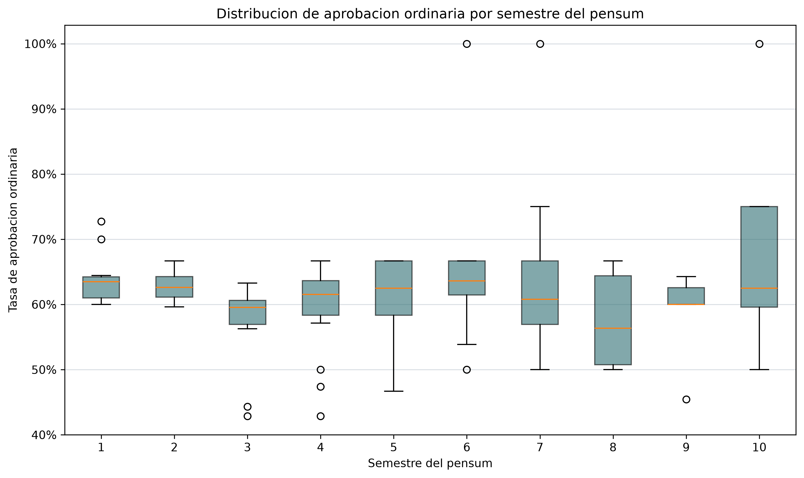

- Pregunta analitica: Como se distribuye la tasa de aprobacion ordinaria por semestre del pensum?
- Descripcion: Diagrama de caja de tasas de aprobacion ordinaria agrupadas por semestre del pensum.
- Interpretacion: La dispersion por semestre permite observar variabilidad entre cursos dentro del mismo nivel curricular.
- Conclusion: La tasa de aprobacion debe interpretarse por curso y semestre, no solo como promedio general.
- Ruta: `outputs/figures/eda/05_distribucion_aprobacion_semestre.png`
### 05_perdida_vs_continuidad.png

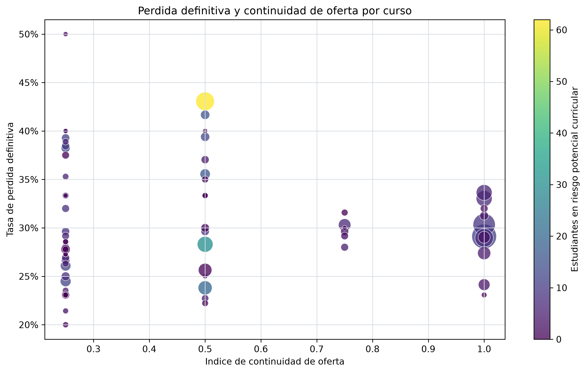

- Pregunta analitica: Como se relacionan descriptivamente la perdida definitiva y la continuidad de oferta?
- Descripcion: Dispersion por curso entre indice de continuidad de oferta y tasa de perdida definitiva.
- Interpretacion: Los puntos combinan continuidad, perdida definitiva y cantidad de estudiantes en riesgo potencial curricular para ubicar cursos que merecen revision integrada.
- Conclusion: La grafica apoya una lectura descriptiva conjunta, sin afirmar causalidad entre continuidad y perdida.
- Ruta: `outputs/figures/eda/05_perdida_vs_continuidad.png`
### 05_riesgo_por_area.png

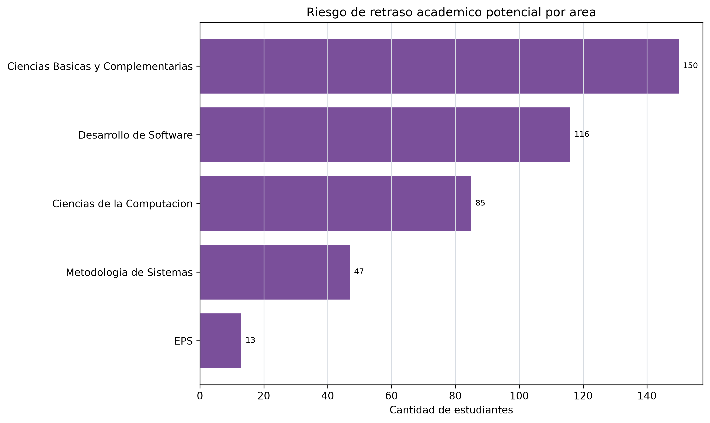

- Pregunta analitica: En que areas academicas se concentra el riesgo de retraso academico potencial?
- Descripcion: Barras horizontales de estudiantes en riesgo potencial curricular por area academica.
- Interpretacion: El area con mayor conteo observado es Ciencias Basicas y Complementarias, con 150 registros.
- Conclusion: El riesgo potencial se concentra de forma desigual entre areas y debe revisarse junto con cursos especificos.
- Ruta: `outputs/figures/eda/05_riesgo_por_area.png`

## Conclusion

La Fase 5 y su extension 5.1 dejan indicadores y graficas para describir la
actividad academica de 2024 desde cuatro perspectivas: oferta por periodo,
resultados academicos registrados, continuidad curricular y flujo posterior
observable despues de una perdida. Los hallazgos permiten priorizar cursos y
areas para analisis estadistico y modelado posterior, manteniendo una lectura
descriptiva y sin exponer registros individuales.
